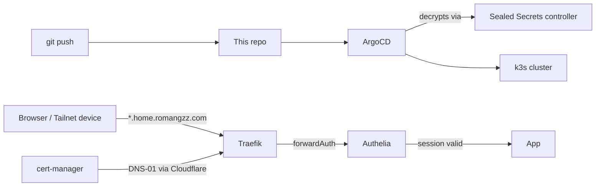

# homelab

A single-node k3s homelab, deployed entirely through ArgoCD from this repo. Media stack, local LLM serving, network management, monitoring, and workflow automation, all GitOps-managed with SSO in front of every admin surface and real TLS certificates throughout.

## Architecture



Everything in the cluster is declared here and reconciled by ArgoCD (`clusters/homelab` → `apps/argocd-apps` → one `Application` per app). Secrets are never plaintext in git — they're `SealedSecret` resources, encrypted client-side with `kubeseal` against the in-cluster controller's public cert, and only that controller can decrypt them. TLS is a single wildcard cert from Let's Encrypt (DNS-01 via Cloudflare), registered as Traefik's default certificate, so every app gets real HTTPS with no per-app cert config. Admin UIs sit behind Authelia via a Traefik `forwardAuth` middleware — one login, enforced at the proxy, not per app.

## Apps

| App | Namespace | Host | Notes |
|---|---|---|---|
| Jellyfin | `media` | `jellyfin.home.romangzz.com` | Media server |
| Seerr | `media` | `seerr.home.romangzz.com` | Request portal for trending/popular content, feeds Radarr/Sonarr |
| qBittorrent | `media` | `qbittorrent.home.romangzz.com` | Torrent client, routed through a VPN sidecar (gluetun) |
| Radarr / Sonarr / Bazarr / Prowlarr | `media` | `{radarr,sonarr,bazarr,prowlarr}.home.romangzz.com` | Media/subtitle/indexer management |
| Unpackerr | `media` | — | Extracts completed downloads; egress-restricted (no internet access needed) |
| Cleanuparr | `media` | `cleanuparr.home.romangzz.com` | Removes stalled/blocked downloads, triggers blocklist + re-search |
| ISO Extractor | `media` | `iso-extractor.home.romangzz.com` | Rips ISOs to MKV; egress-restricted |
| Subgen / Whisper | `media` | `{subgen,whisper}.home.romangzz.com` | Local subtitle generation / ASR |
| ntfy | `media` | `ntfy.home.romangzz.com` | Push notifications for Sonarr/Radarr/Bazarr failures |
| Open WebUI | `ai` | `chat.home.romangzz.com` | Chat UI for local models |
| Ollama | `ai` | `ollama.home.romangzz.com` | Local LLM serving (GPU) |
| Hermes Agent | `ai` | `hermes.home.romangzz.com` | Messaging/cron agent gateway |
| ArgoCD | `argocd` | `argo.home.romangzz.com` | GitOps |
| Grafana / Loki / Alloy | `monitoring` | `grafana.home.romangzz.com` | Metrics + logs (kube-prometheus-stack + Loki) |
| Omada Controller | `omada` | `omada.home.romangzz.com` | Network/AP management |
| Tailscale | `tailscale` | — | Subnet router + exit node |
| n8n | `n8n` | `n8n.home.romangzz.com` (internal), `n8n.romangzz.com` (public, via Cloudflare Tunnel) | Workflow automation |
| Authelia | `auth` | `auth.home.romangzz.com` | SSO login portal |
| Homepage | `dashboard` | `home.romangzz.com` | Single entry point linking everything above |
| cert-manager, Sealed Secrets, nvidia-device-plugin | `cert-manager`, `kube-system` | — | Cluster infrastructure, no UI |

## Prerequisites

- A k3s cluster with ArgoCD installed and bootstrapped to sync from this repo (`clusters/homelab`).
- The Sealed Secrets controller running in-cluster *before* anything else — its private key is the one thing that can never live in this repo. Back it up somewhere offline the moment it's generated.
- `kubeseal` locally, and its public cert cached, to seal any new secret:
  ```
  kubeseal --format yaml --cert <cached-cert.pem> < plaintext-secret.yaml > sealed-secret.yaml
  ```
- A Cloudflare account with the DNS zone for your domain, for cert-manager's DNS-01 challenge and (separately) the n8n tunnel.
- Internal DNS (this repo assumes Omada LAN DNS + Tailscale Split DNS) resolving `*.home.<yourdomain>` to the cluster node.

## CI

Every push and PR runs [`.github/workflows/validate.yml`](.github/workflows/validate.yml): every `kustomization.yaml` in the repo is built and schema-validated in strict mode, and the tree is scanned for accidentally-committed plaintext secrets (see [`.gitleaks.toml`](.gitleaks.toml) for why `SealedSecret` ciphertext doesn't trigger false positives). [Renovate](renovate.json) opens PRs for outdated image tags and Helm chart versions.

## License

MIT — see [LICENSE](LICENSE).
